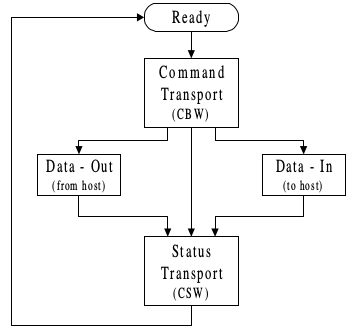
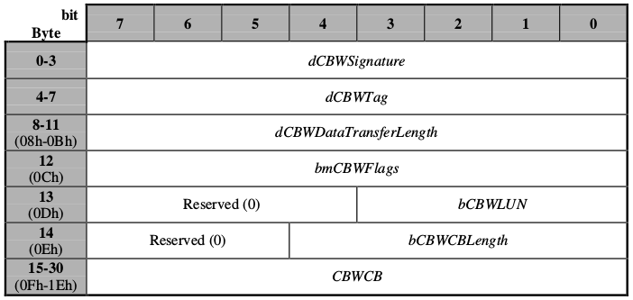
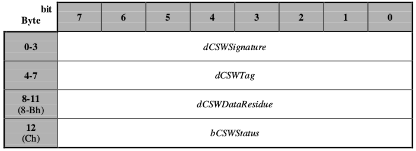

# USB Storage资料汇总

[TOC]

---

## 1. 规范介绍
### 1.1 Mass Storage Class Specification介绍
USB Mass Storage Class specifications由**USB Mass Storage Class Working Group(CWG)**组织维护及发布；包括如下规范：

* USB Mass Storage Class Control/Bulk/Interrupt (CBI) Transport
* __USB Mass Storage Class Bulk-Only (BBB) Transport__
* USB Mass Storage Class UFI (UFI) Command Specification
* USB Mass Storage Class Bootability Specification
* USB Mass Storage Class Compliance Test Specification
* USB Lockable Storage Devices Feature Specification (LSD FS)
* USB Mass Storage Class USB Attached SCSI Protocol (UASP)

**注1：** USB Mass Storage Class Control/Bulk/Interrupt (CBI) Transport specification仅用于**全速软盘驱动器**。

#### 1.1.1 subclass字段定义
USB Mass Storage Class device的接口描述符包含**bInterfaceSubClass**字段。该字段指示了由Mass Storage Class接口传输的工业标准命令集：

Subclass|Command Block Specification|Comment
---|---|---
00h|SCSI command set not reported|De facto use
01h|RBC|Allocated by USB-IF for RBC. RBC is defined outside of USB.
02h|MMC-5(ATAPI)|Allocated by USB-IF for MMC-5. MMC-5 is defined outside of USB.
03h|Obsolete|Was QIC-157
04h|UFI|Specifies how to interface Floppy Disk Drives to USB
05h|Obsolete|Was SFF-8070i
**06h**|**SCSI transparent command set**|**Allocated by USB-IF for SCSI.  SCSI standards are defined outside of USB.**|
07h|LSD FS|LSDFS specifies how host has to negotiate access before trying SCSI|
08h|IEEE 1667|Allocated by USB-IF for IEEE 1667. IEEE 1667 is defined outside of USB.|
09h-FEh|Reserved|Reserved
FFh|Specific to device vendor|De facto use

#### 1.1.2 Protocol字段定义
USB Mass Storage Class device的接口描述符包含**bInterfaceProtocol**字段。该字段指示该接口所支持的传输协议：

bInterfaceProtocol|Protocol Implementation|Comment
--|--|--
00h|CBI (with command completion interrupt)|USB Mass Storage Class Control/Bulk/Interrupt (CBI) Transport
01h|CBI (with no command completion interrupt)|USB Mass Storage Class Control/Bulk/Interrupt (CBI) Transport
02h|Obsolete|
03h-4Fh|Reserved|Reserved
**50h**|**BBB**|**USB Mass Storage Class Bulk-Only (BBB) Transport**
51h-61h|Reserved|Reserved
62h|UAS|Allocated by USB-IF for UAS. UAS is defined outside of USB.
63h-FEh|Reserved|Reserved
FFh|Specific to device vendor|De facto use

#### 1.1.3 Request字段宏定义
USB核心定义了USB控制请求中的**bRequest**字段。即USB下发命令时给的命令类型：

bRequest|Name|Comment
--|--|--
00h|Accept Device-Specific Command (ADSC)|Assigned in context by USB Mass Storage Class Control/Bulk/Interrupt (CBI) Transport,   also aliases core USB request 00h Get Status.
01h-0Dh|Reserved|Aliases of core USB bRequest codes
0Eh-FBh|Reserved|Reserved
FCh|Get Requests|Assigned by Lockable Storage Devices Feature Specification
FDh|Put Requests|Assigned by Lockable Storage Devices Feature Specification
**FEh**|**Get Max LUN (GML)**|**Assigned by USB Mass Storage Class Bulk-Only (BBB) Transport**
**FFh**|**Bulk-Only Mass Storage Reset (BOMSR)**|**Assigned by USB Mass Storage Class Bulk-Only (BBB) Transport**

### 1.2 USB Mass Storage Class Bulk-Only Transport规范
该规范讲解了**Bulk-Only Transport**，即仅通过**Bulk endpoints**传输命令，数据，状态。
#### 1.2.1 功能特性
##### 1.2.1.1 Bulk-Only Mass Storage Reset(*class-specific request*)
该请求用于**reset** mass storage device以及与其关联的接口。
该*class-specific*请求将为下一次的CBW准备好device。
host将通过默认*pipe*发送该请求到device。device将维持*bulk data toggle*位的值和端点STALL状态。
device将会NAK device请求的状态阶段直到*Bulk-Only Mass Storage Reset*完成。
host需要分配一个device请求到默认*pipe*上：

* bmRequestType: Class, Interface, host to device
* bRequest field set to 255 (FFh)
* wValue field set to 0
* wIndex field set to the interface number
* wLength field set to 0

bmRequestType|bRequest|wValue|wIndex|wLength|Data
--|--|--|--|--|--
00100001b|11111111b|0000h|Interface|0000h|none

##### 1.2.1.2 Get Max LUN(*class-specific request*)
获取设备支持的逻辑单元(logical units numbers)的个数。LUN会以连续的方式从0到15(Fh)。
host需分配一个device请求到默认*pipe*上：

* bmRequestType: Class, Interface, device to host
* bRequest field set to 254 (FEh)
* wValue field set to 0
* wIndex field set to the interface number
* wLength field set to 1

bmRequestType|bRequest|wValue|wIndex|wLength|Data
--|--|--|--|--|--
10100001b|11111110b|0000h|Interface|0001h|1 byte

**注2：** device将返回1 byte数据，包含device支持的最大**LUN**值。例如：如果device支持4个LUNs，则LUNs会标示为0到3，且返回值会是3。如果没有LUN与device关联，则返回值为0。
**注3：** 不支持多个LUNs的device可能会**STALL**该命令。

##### 1.2.1.3 Host/Device Packet Transfer Order
host将在关联的Data-Out之前发送CBW，而device将在关联的CBW之后且在关联的CSW之前发送Data-In。host会在请求Data-In或CSW之前发送关联的CBW。
**注4：** 如果dCBWDataTransferLength为0，device和host将不在关联的CBW和CSW之间传输数据。

##### 1.2.1.4 Command Queuing
host只有在接收到任何未解决的CBW的CSW之后才会传输(下一个)CBW。
**注5：** 如果**host**连续下发两个CBWs而没有介入**CSW**或**reset**，device将不确定的相应第二个**CBW**。

#### 1.2.2 Command/Data/Status Protocol
所有的CBW传输都将遵循LSB优先（小端）。
##### 1.2.2.1 Command/Data/Status流程图:

##### 1.2.2.2 Command Block Wrapper结构


**`dCBWSignature:`**
用于帮助识别该数据包为CBW的标签，其值为43425355h(小端)，标示为CBW。

**`dCBWTag:`**
由host设置的**Command Block Tag**。device会将该字段的内容填充到关联的CSW的**dCSWTag**字段以返回给host。

**`dCBWDataTransferLength:`**
host希望在Bulk-In或Bulk-Out端点传输的数据的字节数。如果该字段为0，则device和host将不在CBW和CSW间传输数据，且device将忽略**bmCBWFlags**中的*Direction*位的值。

**`bmCBWFlags:`**
>`Bit 7`&ensp;&ensp;&ensp;&ensp; *Direction*&ensp;&ensp;&ensp;&ensp; 如果**dCBWDataTransferLength**字段为0，device将会忽略该位,  
>&ensp; &ensp;否则：  
>>&ensp; &ensp;0 = Data-Out，从host到device，  
>>&ensp; &ensp;1 = Data-In，从device到host。

>`Bit 6`&ensp;&ensp;&ensp;&ensp; Obsolete&ensp;&ensp;&ensp;&ensp; host将设该位为0。
>`Bit 5..0`&ensp;&ensp;Reserved&ensp;&ensp;&ensp;&ensp;host将设该位为0。

**`bCBWLUN:`**
该*command block*将会被发送到device的哪个**Logical Unit Number**(*LUN*)。

**`bCBWCBLength:`**
**CBWCB**字段的有效长度(*bytes*)。定义*command block*的有效长度。其合法值从1到16。

**`CBWCB:`**
device执行的*command block*。

##### 1.2.2.3 Command Status Wrapper结构
所有的CSW传输都将遵循LSB优先（小端）。


**`dCSWSignature:`**
用于帮助识别该数据包为CSW的标签，其值为53425355h(小端)，标示为CSW。

**`dCSWTag:`**
device将接收到的关联CBW中的**dCBWTag**值设置到该字段。

**`dCSWDataResidue:`**
>对于**Data-Out**：
>>device应在**dCSWDataResidue**中报告**dCBWDataTransferLength**中所述的预期数据量与device处理的实际数据量之间的差额。

>对于**Data-In**：
>>device应在**dCSWDataResidue**中报告**dCBWDataTransferLength**中所述的预期数据量与该device发送的相关数据的实际数量之间的差额。

**注6：** **dCSWDataResidue**不得超过**dCBWDataTransferLength**中发送的值。

**`bCSWStatus:`**
**bCSWStatus**标示命令的成功和失败。如果命令完成成功，device将设置该byte为0。非0标示失败。

Value|Description
--|--
00h|Command Passed ("good status")
01h|Command Failed
02h|Phase Error
03h and 04h|Reserved (Obsolete)
05h to FFh|Reserved

##### 1.2.2.4 Data Transfer Conditions
本节描述host和device如何保持同步。
###### 1.2.2.4.1 Command Transport
host应通过**Bulk-Out**端点发送每个包含*command block*的CBW给device。device应通过接收CBW(ACKing)指示传输成功。如果host检测到Bulk-Out端点STALL，host应响应**Reset**。
###### 1.2.2.4.2 Data Transport
host应尝试将**dCBWDataTransferLength**和*Direction*位指定的确切字节数与device传输。
###### 1.2.2.4.3 Status Transport
device应通过**Bulk-In**端点发送CSW到host。

**Status Transport Flow：**  


###### 1.2.2.4.4 Reset Recovery
对于**Reset Recovery**，host应遵循如下顺序：

* a Bulk-Only Mass Storage Reset
* a Clear Feature HALT to the Bulk-In endpoint
* a Clear Feature HALT to the Bulk-Out endpoint

## 2. USB描述符简述
&ensp;&ensp;&ensp;&ensp;USB协议为USB设备定义了一套描述设备功能和属性的有固定结构的描述符，包括**标准描述符**即**设备描述符**、**配置描述符**、**接口描述符**、**端点描述符**和**字符串描述符**，还有*非标准描述符*，如*类描述符*。USB设备通过这些描述符向USB主机汇报设备的各种属性，主机通过对这些描述符的访问对设备进行**类型识别**、**配置**并为其提供相应的客户端驱动程序。
&ensp;&ensp;&ensp;&ensp;每个USB设备只有一个设备描述符，而一个设备中可包含一个或多个配置描述符，即USB设备可以有多种配置。设备的每一个配置中又可以包含一个或多个接口描述符，即USB设备可以支持多种功能（接口），接口的特性通过描述符提供。
### 2.1 设备描述符
&ensp;&ensp;&ensp;&ensp;设备描述符给出了USB设备的一般信息，包括对设备及在设备配置中起全程作用的信息，包括制造商标识号ID、产品序列号、所属设备类号、默认端点的最大包长度和配置描述符的个数等。一个USB设备必须有且仅有一个设备描述符。
==内核中定义的设备描述结构：==
 
~~~
  /* USB_DT_DEVICE: Device descriptor */
struct usb_device_descriptor {
    __u8  bLength;          /* 描述符长度 */
    __u8  bDescriptorType;  /* 描述符类型编号 */

    __le16 bcdUSB;          /* USB版本号 */
    __u8  bDeviceClass;     /* USB分配的设备类code */
    __u8  bDeviceSubClass;  /* USB分配的子类code */
    __u8  bDeviceProtocol;  /* USB分配的协议code */
    __u8  bMaxPacketSize0;  /* endpoint0最大包大小 */
    __le16 idVendor;        /* 厂商编号 */
    __le16 idProduct;       /* 产品编号 */
    __le16 bcdDevice;       /* 设备出厂编号 */
    __u8  iManufacturer;    /* 描述厂商字符串的索引 */
    __u8  iProduct;         /* 描述产品字符串的索引 */
    __u8  iSerialNumber;    /* 描述设备序列号字符串的索引 */
    __u8  bNumConfigurations;/* 可能的配置数量 */
} __attribute__ ((packed));

#define USB_DT_DEVICE_SIZE      18
~~~
 
 其中**bDescriptorType**为描述符的类型，其含义可查下表：
 
 类型|描述符|bDescriptorType Value
 --|--|--
标准描述符|设备描述符（Device Descriptor)|0x01
|配置描述符（Configuration Descriptor）|0x02
|字符串描述符（String Descriptor）|0x03
|接口描述符（Interface Descriptor）|0x04
|端点描述符（EndPont Descriptor）|0x05
类描述符|集线器类描述符（Hub Descriptor）|0x29
|人机接口类描述符（HID）|0x21
厂商定义的描述符| |0xFF

**bDeviceClass**可查下表：

Decimalism|Hexadecimal|说明
--|--|--
0|0x00|接口描述符中提供类的值
2|0x02|通信类
9|0x09|集线器类
220|0xDC|用于诊断用途的设备类
224|0xE0|无线通信设备类
255|0xFF|厂商定义的设备类

### 2.2 配置描述符
&ensp;&ensp;&ensp;&ensp;配置描述符中包括了描述符的长度（属于此描述符的所有接口描述符和端点描述符的长度的和）、供电方式（自供电/总线供电）、最大耗电量等。

```
/* USB_DT_CONFIG: Configuration descriptor information.
 *
 * USB_DT_OTHER_SPEED_CONFIG is the same descriptor, except that the
 * descriptor type is different.  Highspeed-capable devices can look
 * different depending on what speed they're currently running.  Only
 * devices with a USB_DT_DEVICE_QUALIFIER have any OTHER_SPEED_CONFIG
 * descriptors.
 */
struct usb_config_descriptor {
    __u8  bLength;              /* 描述符长度 */
    __u8  bDescriptorType;      /* 描述符类型编号 */

    __le16 wTotalLength;        /* 配置所返回的所有数据的大小 */
    __u8  bNumInterfaces;       /* 配置所支持的接口数 */
    __u8  bConfigurationValue;  /* Set_Configuration命令需要的参数值 */
    __u8  iConfiguration;       /* 描述该配置的字符串的索引值 */
    __u8  bmAttributes;         /* 供电模式的选择 */
    __u8  bMaxPower;            /* 设备从总线提取的最大电流 */
} __attribute__ ((packed));

#define USB_DT_CONFIG_SIZE      9
```
### 2.3接口描述符
&ensp;&ensp;&ensp;&ensp;配置描述符中包含了一个或多个接口描述符，这里的“接口”并不是指物理存在的接口，在这里把它称之为“功能”更易理解些，例如一个设备既有录音的功能又有扬声器的功能，则这个设备至少就有两个“接口”。

```
/* USB_DT_INTERFACE: Interface descriptor */
struct usb_interface_descriptor {
    __u8  bLength;              /* 描述符长度 */
    __u8  bDescriptorType;      /* 描述符类型 */

    __u8  bInterfaceNumber;     /* 接口的编号 */
    __u8  bAlternateSetting;    /* 备用的接口描述符编号 */
    __u8  bNumEndpoints;        /* 该接口使用的端点数，不包括端点0 */
    __u8  bInterfaceClass;      /* 接口类型 */
    __u8  bInterfaceSubClass;   /* 接口子类型 */
    __u8  bInterfaceProtocol;   /* 接口所遵循的协议 */
    __u8  iInterface;           /* 描述该接口的字符串索引值 */
} __attribute__ ((packed));

#define USB_DT_INTERFACE_SIZE       9
```
&ensp;&ensp;&ensp;&ensp;对于**bInterfaceClass**字段，表示接口所属的类别，USB协议根据功能将不同的接口划分成不同的类，其具体含义如下表所示：

Hexadecimal|类别
--|--
0x01|音频类
0x02|CDC控制类
0x03|人机接口类（HID）
0x05|物理类
0x06|图像类
0x07|打印机类
**0x08**|**大数据存储类**
0x09|集线器类
0x0A|CDC数据类
0x0B|智能卡类
0x0D|安全类
0xDC|诊断设备类
0xE0|无线控制器类
0xFE|特定应用类（包括红外的桥接器等）
0xFF|厂商定义的设备

**注7：** U盘设备的==**bInterfaceProtocol**==固定为**0x50**。

### 2.4端点描述符
&ensp; &ensp;&ensp; &ensp;端点是设备与主机之间进行数据传输的逻辑接口，除配置使用的端点0（控制端点，一般一个设备只有一个控制端点）为双向端口外，其它均为单向。端点描述符描述了数据的传输类型、传输方向、数据包大小和端点号（也可称为端点地址）等。

```
/* USB_DT_ENDPOINT: Endpoint descriptor */
struct usb_endpoint_descriptor {
    __u8  bLength;              /* 描述符长度 */
    __u8  bDescriptorType;      /* 描述符类型 */

    __u8  bEndpointAddress;     /* 端点地址:[0:3]端点号，[7]方向(0-输出，1-输入) */
    __u8  bmAttributes;         /* 端点属性:[0:1](00-控制,01-同步,02-批量,03-中断) */
    __le16 wMaxPacketSize;      /* 本端点接收或发送的最大信息包的大小 */
    __u8  bInterval;            /* 轮询数据传送端点的时间间隔:同步-1,中断-(1-255) */

    /* NOTE:  these two are _only_ in audio endpoints. */
    /* use USB_DT_ENDPOINT*_SIZE in bLength, not sizeof. */
    __u8  bRefresh;
    __u8  bSynchAddress;
} __attribute__ ((packed));

#define USB_DT_ENDPOINT_SIZE        7
#define USB_DT_ENDPOINT_AUDIO_SIZE  9   /* Audio extension */
```
**注8：** U盘的==**bmAttributes**==字段固定为0x02。

### 2.5 lsusb查看U盘设备分析
现通过使用lsusb命令来具体分析一个U盘所列举出的描述符信息：

```C
# lsusb -v -d 0930:1408

Bus 001 Device 006: ID 0930:1408 Toshiba Corp. 
Device Descriptor:
  bLength                18
  bDescriptorType         1		/* 设备描述符类型 */
  bcdUSB               2.10			/* USB2.0规范 */
  bDeviceClass            0 (Defined at Interface level)
  bDeviceSubClass         0 
  bDeviceProtocol         0 
  bMaxPacketSize0        64		/* 端点0最大包大小 */
  idVendor           0x0930 Toshiba Corp.
  idProduct          0x1408
  bcdDevice            0.01
  iManufacturer           1 TOSHIBA
  iProduct                2 USB FLASH DRIVE
  iSerial                 3 7427EAB351F9C290C0020888
  bNumConfigurations      1		/* 配置描述符的数量 */
  Configuration Descriptor:
    bLength                 9
    bDescriptorType         2		/* 配置描述符类型 */
    wTotalLength           32		/* 返回给配置的数据总长度，包括后续的其它描述符 9 + 9 + 7 + 7 */
    bNumInterfaces          1		/*该配置支持的接口数 */
    bConfigurationValue     1		/* SetConfiguration()请求时作为参数来选择该配置 */
    iConfiguration          0 
    bmAttributes         0x80		/* Bit 7 is reserved and must be set to one for historical reasons. */
      (Bus Powered)
    MaxPower              300mA
    Interface Descriptor:
      bLength                 9
      bDescriptorType         4		/* 接口描述符类型 */
      bInterfaceNumber        0		/* 本接口编号 */
      bAlternateSetting       0		/* 备用接口描述符编号 */
      bNumEndpoints           2		/* 接口包含的端点数 */
      bInterfaceClass         8 Mass Storage  /* MASS STORAGE Class. */
      bInterfaceSubClass      6 SCSI		/* 接口子类型 */
      bInterfaceProtocol     80 Bulk-Only	/* BULK-ONLY TRANSPORT. */
      iInterface              0 
      Endpoint Descriptor:
        bLength                 7
        bDescriptorType         5				/* 端点描述符类型 */
        bEndpointAddress     0x81  EP 1 IN	/* [3..0] - 端点号，[7] - In */
        bmAttributes            2				/* 端点属性：This is a Bulk endpoint. */
          Transfer Type            Bulk
          Synch Type               None
          Usage Type               Data
        wMaxPacketSize     0x0200  1x 512 bytes	/* 最大包大小 */
        bInterval             255
      Endpoint Descriptor:
        bLength                 7
        bDescriptorType         5
        bEndpointAddress     0x02  EP 2 OUT		/* 端点2，方向Out */
        bmAttributes            2
          Transfer Type            Bulk
          Synch Type               None
          Usage Type               Data
        wMaxPacketSize     0x0200  1x 512 bytes
        bInterval             255
Binary Object Store Descriptor:
  bLength                 5
  bDescriptorType        15
  wTotalLength           22
  bNumDeviceCaps          2
  USB 2.0 Extension Device Capability:
    bLength                 7
    bDescriptorType        16
    bDevCapabilityType      2
    bmAttributes   0x00000006
      Link Power Management (LPM) Supported
  SuperSpeed USB Device Capability:
    bLength                10
    bDescriptorType        16
    bDevCapabilityType      3
    bmAttributes         0x00
    wSpeedsSupported   0x000e
      Device can operate at Full Speed (12Mbps)
      Device can operate at High Speed (480Mbps)
      Device can operate at SuperSpeed (5Gbps)
    bFunctionalitySupport   2
      Lowest fully-functional device speed is High Speed (480Mbps)
    bU1DevExitLat          10 micro seconds
    bU2DevExitLat        2047 micro seconds
Device Status:     0x0000
  (Bus Powered)
```